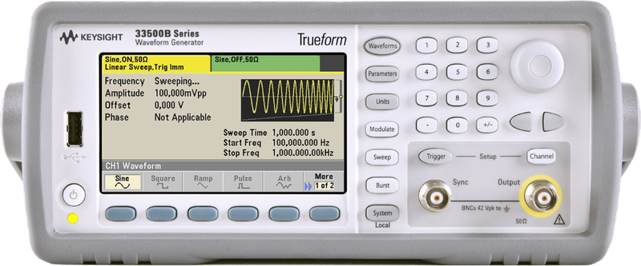

# Keysight33521B

{.lead}
A driver for [`InstroAWG`](/awg.md)

{.driver-image}

The {py:obj}`Keysight33521B <instro.awg.drivers.keysight_33521b.Keysight33521B>` provides a driver that can be used to instantiate an [InstroAWG](/awg.md).

## Creating an [`InstroAWG`](/awg.md) with {py:obj}`Keysight33521B <instro.awg.drivers.keysight_33521b.Keysight33521B>`

```python
from instro.awg.drivers import Keysight33521B
from instro.awg import InstroAWG

awg = InstroAWG(
    name="myAWG",
    driver=Keysight33521B(visa_resource="USB0::..."),
    num_channels=1,
)
```

Parameters and methods specific to {py:obj}`Keysight33521B <instro.awg.drivers.keysight_33521b.Keysight33521B>` can be found in the [SDK](/sdk/index.md).
