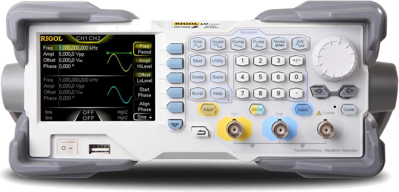

# RigolDG1022Z

{.lead}
A driver for [`InstroAWG`](/awg.md)

{.driver-image}

The {py:obj}`RigolDG1022Z <instro.awg.drivers.rigol_dg1022z.RigolDG1022Z>` provides a driver that can be used to instantiate an [InstroAWG](/awg.md).

## Creating an [`InstroAWG`](/awg.md) with {py:obj}`RigolDG1022Z <instro.awg.drivers.rigol_dg1022z.RigolDG1022Z>`

```python
from instro.awg.drivers import RigolDG1022Z
from instro.awg import InstroAWG

awg = InstroAWG(
    name="myAWG",
    driver=RigolDG1022Z(visa_resource="USB0::0x1AB1::0x0642::DG1ZA000000000::INSTR"),
    num_channels=2,
)
```

Parameters and methods specific to {py:obj}`RigolDG1022Z <instro.awg.drivers.rigol_dg1022z.RigolDG1022Z>` can be found in the [SDK](/sdk/index.md).
