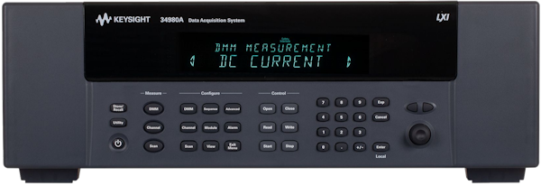

# Keysight34980A

{.lead}
A driver for [`InstroDAQ`](/daq.md)

{.driver-image}

The {py:obj}`Keysight34980A <instro.daq.drivers.keysight_34980a.Keysight34980A>` provides a driver that can be used to instantiate an [InstroDAQ](/daq.md). Unlike the other DAQ drivers, it owns its own `VisaDriver` and connects over SCPI/VISA rather than a vendor SDK.

## Creating an [`InstroDAQ`](/daq.md) with {py:obj}`Keysight34980A <instro.daq.drivers.keysight_34980a.Keysight34980A>`

```python
from instro.daq import InstroDAQ
from instro.daq.drivers import Keysight34980A

daq = InstroDAQ(
    name="keysightDAQ",
    driver=Keysight34980A("TCPIP0::<IP_ADDRESS>::INSTR"),
)
```

Parameters and methods specific to {py:obj}`Keysight34980A <instro.daq.drivers.keysight_34980a.Keysight34980A>` can be found in the [SDK](/sdk/index.md).
