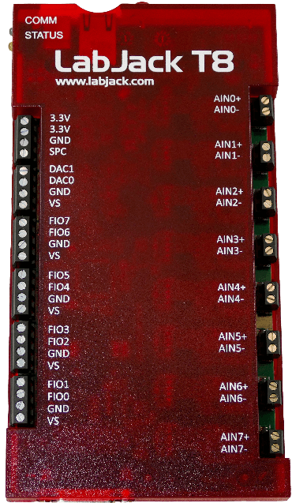

# LabJackTSeriesDriver

{.lead}
A driver for [`InstroDAQ`](/daq.md)

{.driver-image}

The {py:obj}`LabJackTSeriesDriver <instro.daq.drivers.labjack.t_series.LabJackTSeriesDriver>` provides a driver that can be used to instantiate an [InstroDAQ](/daq.md).

## Creating an [`InstroDAQ`](/daq.md) with {py:obj}`LabJackTSeriesDriver <instro.daq.drivers.labjack.t_series.LabJackTSeriesDriver>`

```python
from instro.daq import InstroDAQ
from instro.daq.drivers.labjack import LabJackTSeriesDriver

# serial number, device name, or IP address
daq = InstroDAQ(name="ljDAQ", driver=LabJackTSeriesDriver(device_id="440020473"))
```

Parameters and methods specific to {py:obj}`LabJackTSeriesDriver <instro.daq.drivers.labjack.t_series.LabJackTSeriesDriver>` can be found in the [SDK](/sdk/index.md).
