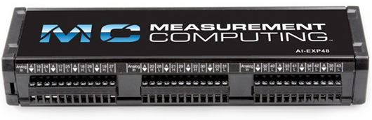

# MCCDriver

{.lead}
A driver for [`InstroDAQ`](/daq.md)

{.driver-image}

The {py:obj}`MCCDriver <instro.daq.drivers.mcc.mccdaq.MCCDriver>` provides a driver that can be used to instantiate an [InstroDAQ](/daq.md). It covers Measurement Computing USB and Ethernet DAQ devices through the MCC Universal Library (`mcculw`).

## Creating an [`InstroDAQ`](/daq.md) with {py:obj}`MCCDriver <instro.daq.drivers.mcc.mccdaq.MCCDriver>`

```python
from instro.daq import InstroDAQ
from instro.daq.drivers.mcc import MCCDriver

# device unique ID, optionally suffixed with a board number
daq = InstroDAQ(name="mccDAQ", driver=MCCDriver(device_id="344371:0"))
```

Parameters and methods specific to {py:obj}`MCCDriver <instro.daq.drivers.mcc.mccdaq.MCCDriver>` can be found in the [SDK](/sdk/index.md).
