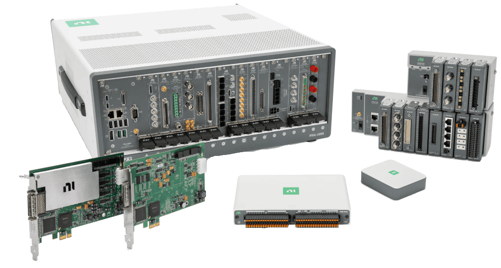

# NIDAQDriver

{.lead}
A driver for [`InstroDAQ`](/daq.md)

{.driver-image}

The {py:obj}`NIDAQDriver <instro.daq.drivers.ni.nidaq.NIDAQDriver>` provides a driver that can be used to instantiate an [InstroDAQ](/daq.md).

## Creating an [`InstroDAQ`](/daq.md) with {py:obj}`NIDAQDriver <instro.daq.drivers.ni.nidaq.NIDAQDriver>`

```python
from instro.daq import InstroDAQ
from instro.daq.drivers.ni import NIDAQDriver

# device name from NI-MAX
daq = InstroDAQ(name="niDAQ", driver=NIDAQDriver(device_id="Dev1"))
```

Parameters and methods specific to {py:obj}`NIDAQDriver <instro.daq.drivers.ni.nidaq.NIDAQDriver>` can be found in the [SDK](/sdk/index.md).
