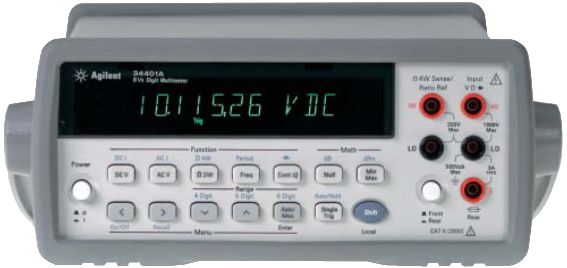

# Agilent34401A

{.lead}
A driver for [`InstroDMM`](/dmm.md)

{.driver-image}

The {py:obj}`Agilent34401A <instro.dmm.drivers.agilent_a34401a.Agilent34401A>` provides a driver that can be used to instantiate an [InstroDMM](/dmm.md). It also covers the rebadged HP and Keysight 34401A.

## Creating an [`InstroDMM`](/dmm.md) with {py:obj}`Agilent34401A <instro.dmm.drivers.agilent_a34401a.Agilent34401A>`

```python
from instro.dmm.drivers import Agilent34401A
from instro.dmm import InstroDMM

dmm = InstroDMM(
    name="myDMM",
    driver=Agilent34401A("ASRL3::INSTR"),
)
```

Parameters and methods specific to {py:obj}`Agilent34401A <instro.dmm.drivers.agilent_a34401a.Agilent34401A>` can be found in the [SDK](/sdk/index.md).
