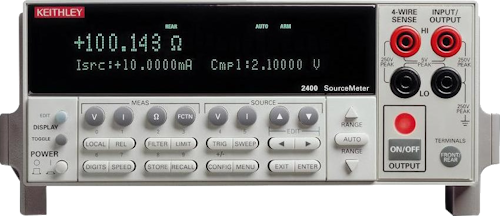

# Keithley2400

{.lead}
A driver for [`InstroDMM`](/dmm.md)

{.driver-image}

The {py:obj}`Keithley2400 <instro.dmm.drivers.keithley_2400.Keithley2400>` provides a driver that can be used to instantiate an [InstroDMM](/dmm.md), in measurement-only mode.

## Creating an [`InstroDMM`](/dmm.md) with {py:obj}`Keithley2400 <instro.dmm.drivers.keithley_2400.Keithley2400>`

```python
from instro.dmm.drivers import Keithley2400
from instro.dmm import InstroDMM

dmm = InstroDMM(
    name="myDMM",
    driver=Keithley2400("<visa_resource>"),
)
```

Parameters and methods specific to {py:obj}`Keithley2400 <instro.dmm.drivers.keithley_2400.Keithley2400>` can be found in the [SDK](/sdk/index.md).
