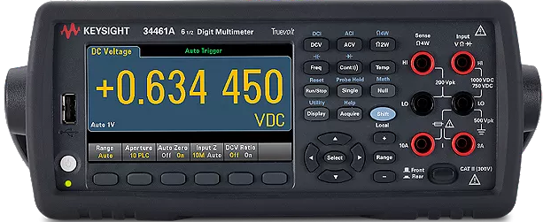

# Keysight34461A

{.lead}
A driver for [`InstroDMM`](/dmm.md)

{.driver-image}

The {py:obj}`Keysight34461A <instro.dmm.drivers.keysight_34461a.Keysight34461A>` provides a driver that can be used to instantiate an [InstroDMM](/dmm.md).

## Creating an [`InstroDMM`](/dmm.md) with {py:obj}`Keysight34461A <instro.dmm.drivers.keysight_34461a.Keysight34461A>`

```python
from instro.dmm.drivers import Keysight34461A
from instro.dmm import InstroDMM

dmm = InstroDMM(
    name="myDMM",
    driver=Keysight34461A("<visa_resource>"),
)
```

Parameters and methods specific to {py:obj}`Keysight34461A <instro.dmm.drivers.keysight_34461a.Keysight34461A>` can be found in the [SDK](/sdk/index.md).
