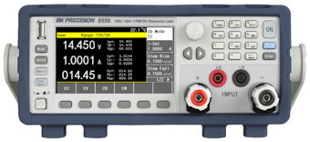

# BK85XXB

{.lead}
A driver for [`InstroELoad`](/eload.md)

{.driver-image}

The {py:obj}`BK85XXB <instro.eload.drivers.bk_85xxb.BK85XXB>` provides a driver that can be used to instantiate an [InstroELoad](/eload.md).

## Creating an [`InstroELoad`](/eload.md) with {py:obj}`BK85XXB <instro.eload.drivers.bk_85xxb.BK85XXB>`

```python
from instro.eload.drivers import BK85XXB
from instro.eload import InstroELoad

eload = InstroELoad(
    name="myELoad",
    driver=BK85XXB(visa_resource="USB0::0x0614::0x0960::8514B12345::INSTR"),
)
```

Parameters and methods specific to {py:obj}`BK85XXB <instro.eload.drivers.bk_85xxb.BK85XXB>` can be found in the [SDK](/sdk/index.md).
