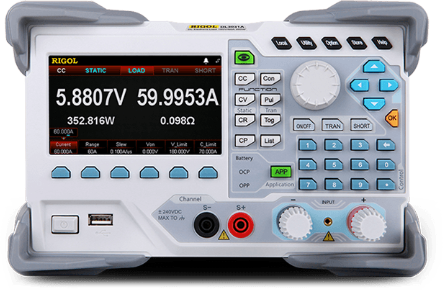

# RigolDL3000

{.lead}
A driver for [`InstroELoad`](/eload.md)

{.driver-image}

The {py:obj}`RigolDL3000 <instro.eload.drivers.rigol_dl3000.RigolDL3000>` provides a driver that can be used to instantiate an [InstroELoad](/eload.md).

## Creating an [`InstroELoad`](/eload.md) with {py:obj}`RigolDL3000 <instro.eload.drivers.rigol_dl3000.RigolDL3000>`

```python
from instro.eload.drivers import RigolDL3000
from instro.eload import InstroELoad

eload = InstroELoad(
    name="myELoad",
    driver=RigolDL3000(visa_resource="USB0::0x1AB1::0x0E11::DL3A000001::INSTR"),
)
```

## Limitations

- `short_output` raises `FeatureNotSupportedError`. The DL3000 programming guide has no short-circuit command.
- `set_range` raises `FeatureNotSupportedError` in CP mode. The DL3000 has no CP range.
- Disable the input before you change the range. The DL3000 user guide gives this caution for each range setting.
- Set the range before the level. A range change resets the level to 0.
- In CR mode, the load rejects a range that does not cover the present level.

Parameters and methods specific to {py:obj}`RigolDL3000 <instro.eload.drivers.rigol_dl3000.RigolDL3000>` can be found in the [SDK](/sdk/index.md).
