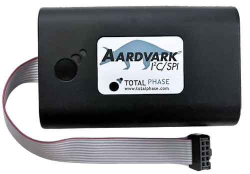

# Aardvark

{.lead}
A driver for [`I2CInterface`](/library/protocols/i2c/overview.md)

{.driver-image}

The {py:obj}`Aardvark <instro.i2c.drivers.totalphase.aardvark.Aardvark>` provides a driver that can be used to instantiate an [I2CInterface](/library/protocols/i2c/overview.md).

## Creating an [`I2CInterface`](/library/protocols/i2c/overview.md) with {py:obj}`Aardvark <instro.i2c.drivers.totalphase.aardvark.Aardvark>`

```python
from instro.i2c import I2CInterface

# The adapter comes from the config's `connection` block:
#   "connection": {"interface": "aardvark", "serial_number": "123456"}
i2c = I2CInterface(config="sensor_bus.json")
```

Or pass the driver explicitly, which overrides the config's `connection` block:

```python
from instro.i2c.drivers.totalphase import Aardvark
from instro.i2c import I2CInterface

i2c = I2CInterface(config="sensor_bus.json", driver=Aardvark(serial_number="123456"))
```

See the [System Definition](/library/protocols/i2c/system-definition.md) page for the config file format.

Parameters and methods specific to {py:obj}`Aardvark <instro.i2c.drivers.totalphase.aardvark.Aardvark>` can be found in the [SDK](/sdk/index.md).
