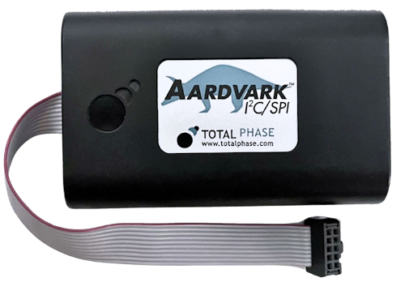

# Aardvark

{.lead}
Control the Total Phase Aardvark I2C adapter from Python through [`I2CInterface`](/library/protocols/i2c/overview.md).

{.driver-image}

The {py:obj}`Aardvark <instro.i2c.drivers.totalphase.aardvark.Aardvark>` provides a driver that can be used to instantiate an [I2CInterface](/library/protocols/i2c/overview.md).

## Creating an [`I2CInterface`](/library/protocols/i2c/overview.md) with {py:obj}`Aardvark <instro.i2c.drivers.totalphase.aardvark.Aardvark>`

```python
from instro import I2CInterface, SystemDefinition
from instro.drivers import Aardvark

# Create system definition (see the System Definition page for details)
system = SystemDefinition()
# ... add devices to system definition ...

i2c = I2CInterface(
    name="main_i2c",
    driver=Aardvark(serial_number="123456"),
    system_definition=system,
)
```

To define the devices, registers and commands in `system`, see [System Definition](/library/protocols/i2c/system-definition.md).

Parameters and methods specific to {py:obj}`Aardvark <instro.i2c.drivers.totalphase.aardvark.Aardvark>` can be found in the [Reference](/ref/index.md).
