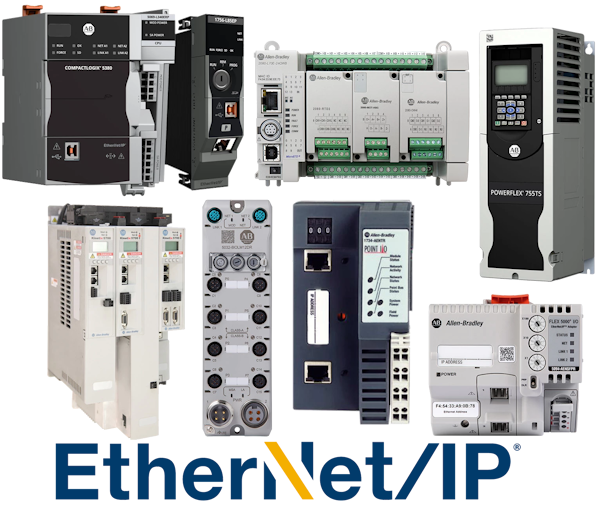

# Allen-Bradley

{.lead}
A vendor family for [`EtherNetIPDevice`](/library/protocols/ethernetip.md)

{.driver-image}

Allen-Bradley is the PLC vendor family [`EtherNetIPDevice`](/library/protocols/ethernetip.md) targets, not a separate driver class: the config's `device.manufacturer` field names it, and the `connection` block points at the PLC. Other Allen-Bradley Logix-family PLCs may work through the same underlying protocol, though current hardware testing covers only the [CompactLogix](/library/protocols/ethernetip/CompactLogix.md) 5332E 1769-L32E.

## Creating an {py:obj}`EtherNetIPDevice <instro.ethernetip.EtherNetIPDevice>` for an Allen-Bradley PLC

```json
{
  "version": 1,
  "protocol": "ethernetip",
  "device": {
    "name": "line_plc",
    "description": "Allen-Bradley PLC for line telemetry",
    "manufacturer": "Allen-Bradley",
    "model": "CompactLogix 5332E 1769-L32E"
  },
  "connection": {
    "host": "192.168.1.10",
    "port": 44818,
    "route_path": {
      "hops": [
        {"type": "backplane", "slot": 0}
      ]
    }
  },
  "timing": {
    "poll_interval": 1.0
  }
}
```

```python
from instro.ethernetip import EtherNetIPDevice

with EtherNetIPDevice(config="line_plc.json", autostart=True) as plc:
    ...
```

Parameters and methods specific to {py:obj}`EtherNetIPDevice <instro.ethernetip.EtherNetIPDevice>` can be found in the [SDK](/sdk/index.md).
