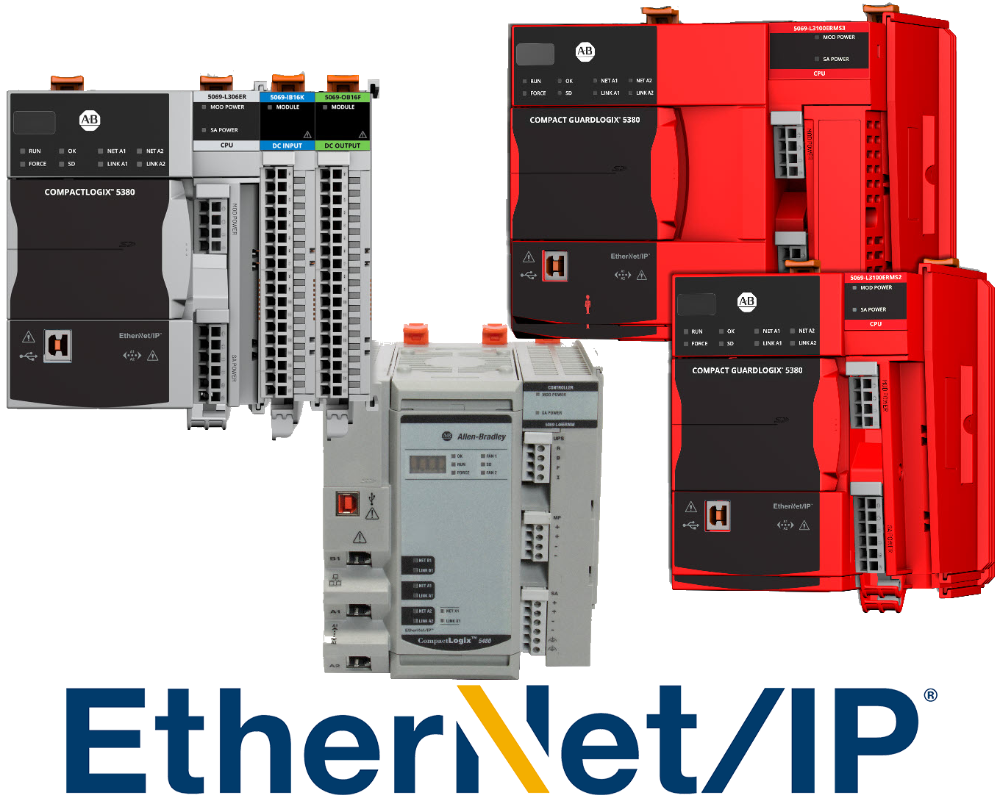

# CompactLogix

{.lead}
A tested PLC model for [`EtherNetIPDevice`](/library/protocols/ethernetip.md)

{.driver-image}

CompactLogix is the specific [Allen-Bradley](/library/protocols/ethernetip/AllenBradley.md) PLC family [`EtherNetIPDevice`](/library/protocols/ethernetip.md) has been hardware-tested against (CompactLogix 5332E 1769-L32E), not a separate driver class.

## Creating an {py:obj}`EtherNetIPDevice <instro.ethernetip.EtherNetIPDevice>` for a CompactLogix PLC

```json
{
  "version": 1,
  "protocol": "ethernetip",
  "device": {
    "name": "line_plc",
    "description": "CompactLogix PLC for line telemetry",
    "manufacturer": "Allen-Bradley",
    "model": "CompactLogix 5332E 1769-L32E"
  },
  "connection": {
    "host": "192.168.1.10",
    "port": 44818,
    "route_path": {
      "hops": [
        {"type": "backplane", "slot": 0}
      ]
    }
  },
  "timing": {
    "poll_interval": 1.0
  }
}
```

```python
import time

from instro.lib.publishers import NominalCorePublisher
from instro.ethernetip import EtherNetIPDevice

RID = "<dataset_rid>"  # Nominal Core dataset RID.

with EtherNetIPDevice(config="compactlogix.json", autostart=True) as plc:
    plc.add_publisher(NominalCorePublisher(dataset_rid=RID))
    time.sleep(10)
```

Parameters and methods specific to {py:obj}`EtherNetIPDevice <instro.ethernetip.EtherNetIPDevice>` can be found in the [SDK](/sdk/index.md).
