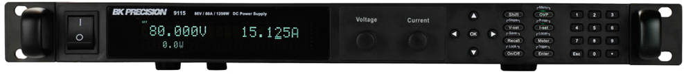

# BK9115

{.lead}
A driver for [`InstroPSU`](/psu.md)

{.driver-image}

The {py:obj}`BK9115 <instro.psu.drivers.bk_9115.BK9115>` provides a driver that can be used to instantiate an [InstroPSU](/psu.md).

## Creating an [`InstroPSU`](/psu.md) with {py:obj}`BK9115 <instro.psu.drivers.bk_9115.BK9115>`

```python
from instro.psu.drivers import BK9115
from instro.psu import InstroPSU

psu = InstroPSU(
    name="myPSU",
    driver=BK9115(visa_resource="USB0::..."),
    num_channels=1,
)
```

Parameters and methods specific to {py:obj}`BK9115 <instro.psu.drivers.bk_9115.BK9115>` can be found in the [SDK](/sdk/index.md).
