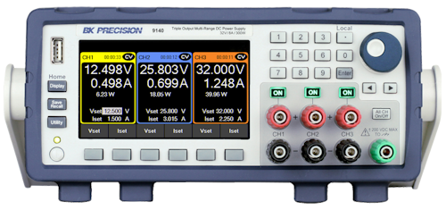

# BK914X

{.lead}
A driver for [`InstroPSU`](/psu.md)

{.driver-image}

The {py:obj}`BK914X <instro.psu.drivers.bk_914x.BK914X>` provides a driver that can be used to instantiate an [InstroPSU](/psu.md).

## Creating an [`InstroPSU`](/psu.md) with {py:obj}`BK914X <instro.psu.drivers.bk_914x.BK914X>`

```python
from instro.psu.drivers import BK914X
from instro.psu import InstroPSU

psu = InstroPSU(
    name="myPSU",
    driver=BK914X(visa_resource="USB0::..."),
    num_channels=3,  # 1-3, depending on the exact 914X model
)
```

Parameters and methods specific to {py:obj}`BK914X <instro.psu.drivers.bk_914x.BK914X>` can be found in the [SDK](/sdk/index.md).
