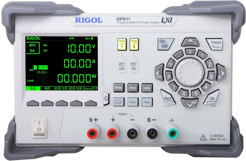

# RigolDP800

{.lead}
A driver for [`InstroPSU`](/psu.md)

{.driver-image}

The {py:obj}`RigolDP800 <instro.psu.drivers.rigol_dp800.RigolDP800>` provides a driver that can be used to instantiate an [InstroPSU](/psu.md).

## Creating an [`InstroPSU`](/psu.md) with {py:obj}`RigolDP800 <instro.psu.drivers.rigol_dp800.RigolDP800>`

```python
from instro.psu.drivers import RigolDP800
from instro.psu import InstroPSU

psu = InstroPSU(
    name="myPSU",
    driver=RigolDP800(visa_resource="USB0::..."),
    num_channels=3,  # DP811 has 1, DP821 has 2, DP831/DP832 have 3
)
```

## Operating mode

`get_operating_mode` reads the channel's questionable-status condition register (`:STAT:QUES:INST:ISUM<n>:COND?`) in a single query. Its low two bits give `OperatingMode.OFF`, `OperatingMode.CONSTANT_CURRENT`, `OperatingMode.CONSTANT_VOLTAGE`, or `OperatingMode.UNREGULATED` (the DP800's critical state between CV and CC). The `:OUTP:MODE?` query is not used because it still answers `CV` for a disabled channel.

Parameters and methods specific to {py:obj}`RigolDP800 <instro.psu.drivers.rigol_dp800.RigolDP800>` can be found in the [SDK](/sdk/index.md).
