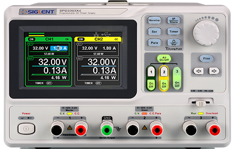

# SiglentSPD3303

{.lead}
A driver for [`InstroPSU`](/psu.md)

{.driver-image}

The {py:obj}`SiglentSPD3303 <instro.psu.drivers.siglent_spd3303.SiglentSPD3303>` provides a driver that can be used to instantiate an [InstroPSU](/psu.md).

## Creating an [`InstroPSU`](/psu.md) with {py:obj}`SiglentSPD3303 <instro.psu.drivers.siglent_spd3303.SiglentSPD3303>`

```python
from instro.psu.drivers import SiglentSPD3303
from instro.psu import InstroPSU

psu = InstroPSU(
    name="myPSU",
    driver=SiglentSPD3303(visa_resource="USB0::0xF4EC::0x1430::SPD3XJGQ806726::INSTR"),
    num_channels=2,
)
```

Parameters and methods specific to {py:obj}`SiglentSPD3303 <instro.psu.drivers.siglent_spd3303.SiglentSPD3303>` can be found in the [SDK](/sdk/index.md).
