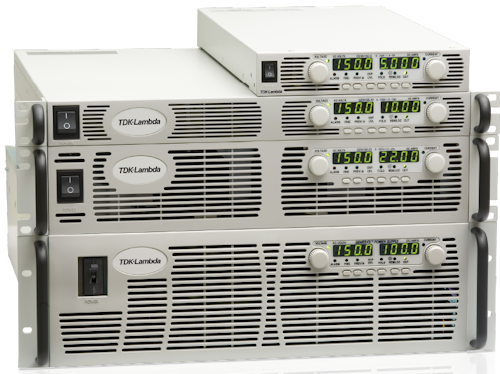

# TDKLambdaGenesys

{.lead}
A driver for [`InstroPSU`](/psu.md)

{.driver-image}

The {py:obj}`TDKLambdaGenesys <instro.psu.drivers.tdk_lambda_genesys.TDKLambdaGenesys>` provides a driver that can be used to instantiate an [InstroPSU](/psu.md). It also covers white-label Agilent/Keysight N5700-series supplies, which speak the same command set.

## Creating an [`InstroPSU`](/psu.md) with {py:obj}`TDKLambdaGenesys <instro.psu.drivers.tdk_lambda_genesys.TDKLambdaGenesys>`

```python
from instro.psu.drivers import TDKLambdaGenesys
from instro.psu import InstroPSU

psu = InstroPSU(
    name="myPSU",
    driver=TDKLambdaGenesys(visa_resource="USB0::..."),
    num_channels=1,
)
```

Parameters and methods specific to {py:obj}`TDKLambdaGenesys <instro.psu.drivers.tdk_lambda_genesys.TDKLambdaGenesys>` can be found in the [SDK](/sdk/index.md).
