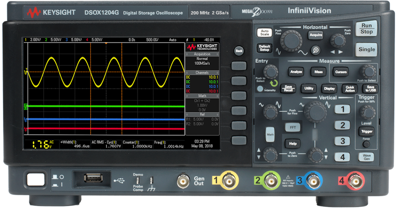

# Keysight1200X

{.lead}
A driver for [`InstroScope`](/scope.md)

{.driver-image}

The {py:obj}`Keysight1200X <instro.scope.drivers.keysight_1200x.Keysight1200X>` provides a driver that can be used to instantiate an [InstroScope](/scope.md).

## Creating an [`InstroScope`](/scope.md) with {py:obj}`Keysight1200X <instro.scope.drivers.keysight_1200x.Keysight1200X>`

```python
from instro.scope.drivers import Keysight1200X
from instro.scope import InstroScope

scope = InstroScope(
    name="myScope",
    driver=Keysight1200X("<visa_resource>"),
    num_channels=4,
)
```

Parameters and methods specific to {py:obj}`Keysight1200X <instro.scope.drivers.keysight_1200x.Keysight1200X>` can be found in the [SDK](/sdk/index.md).
