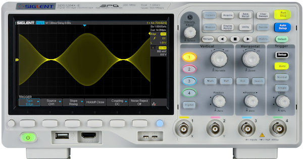

# SiglentSDS1000XE

{.lead}
A driver for [`InstroScope`](/scope.md)

{.driver-image}

The {py:obj}`SiglentSDS1000XE <instro.scope.drivers.siglent_sds1000x_e.SiglentSDS1000XE>` provides a driver that can be used to instantiate an [InstroScope](/scope.md).

## Creating an [`InstroScope`](/scope.md) with {py:obj}`SiglentSDS1000XE <instro.scope.drivers.siglent_sds1000x_e.SiglentSDS1000XE>`

```python
from instro.scope.drivers import SiglentSDS1000XE
from instro.scope import InstroScope

scope = InstroScope(
    name="myScope",
    driver=SiglentSDS1000XE("<visa_resource>"),
    num_channels=4,
)
```

Parameters and methods specific to {py:obj}`SiglentSDS1000XE <instro.scope.drivers.siglent_sds1000x_e.SiglentSDS1000XE>` can be found in the [SDK](/sdk/index.md).
