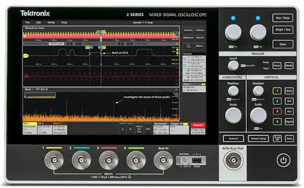

# Tektronix2SeriesMSO

{.lead}
A driver for [`InstroScope`](/scope.md)

{.driver-image}

The {py:obj}`Tektronix2SeriesMSO <instro.scope.drivers.tektronix_2series.Tektronix2SeriesMSO>` provides a driver that can be used to instantiate an [InstroScope](/scope.md).

## Creating an [`InstroScope`](/scope.md) with {py:obj}`Tektronix2SeriesMSO <instro.scope.drivers.tektronix_2series.Tektronix2SeriesMSO>`

```python
from instro.scope.drivers import Tektronix2SeriesMSO
from instro.scope import InstroScope

scope = InstroScope(
    name="myScope",
    driver=Tektronix2SeriesMSO("<visa_resource>"),
    num_channels=4,
)
```

Parameters and methods specific to {py:obj}`Tektronix2SeriesMSO <instro.scope.drivers.tektronix_2series.Tektronix2SeriesMSO>` can be found in the [SDK](/sdk/index.md).
